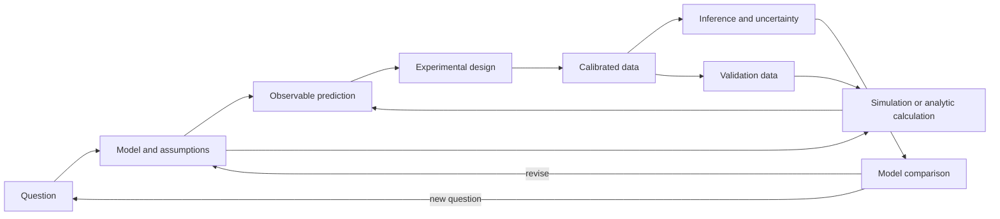

# Theory Experiment Computation Loop

The loop is only as strong as its weakest interface. A beautiful model without an observable is not yet an empirical theory; a precise dataset without a measurement model is not yet a physical conclusion.

## Interface checklist

- Question → model: scope and alternatives are explicit.
- Model → prediction: approximation and numerical errors are bounded.
- Prediction → design: the observable separates plausible models.
- Instrument → data: calibration, background, selection, and drift are modeled.
- Data → inference: likelihood and priors are inspectable.
- Inference → claim: effect size, uncertainty, and domain are reported.

Navigate: [[Experimental Physics Map]] · [[Computational Physics Map]] · [[Epistemic Status and Claim Hygiene]]
