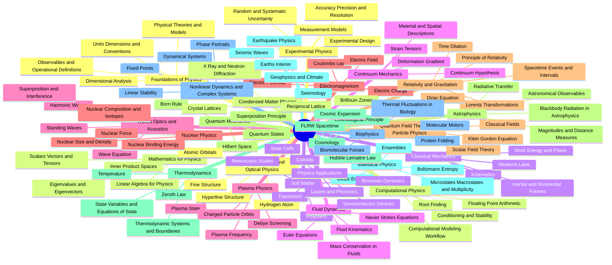

# Physics Worldmap Canvas

Open [[Physics Worldmap.canvas|Spatial Physics Worldmap]] for the zoomable canvas. This note is the text-first fallback and graph entry point.

### Foundations and tools

[[Foundations of Physics Map]] · [[Mathematics for Physics Map]] · [[Experimental Physics Map]] · [[Computational Physics Map]]

### Classical and continuum

[[Classical Mechanics Map]] · [[Continuum Mechanics Map]] · [[Waves Optics and Acoustics Map]] · [[Electromagnetism Map]] · [[Fluid Dynamics Map]]

### Quantum and matter

[[Quantum Mechanics Map]] · [[Thermodynamics Map]] · [[Statistical Physics Map]] · [[Atomic Molecular and Optical Physics Map]] · [[Condensed Matter Physics Map]] · [[Soft Matter Map]]

### Fundamental and cosmic

[[Relativity and Gravitation Map]] · [[Nuclear Physics Map]] · [[Quantum Field Theory and Particle Physics Map]] · [[Plasma Physics Map]] · [[Astrophysics Map]] · [[Cosmology Map]]

### Earth life complexity and use

[[Nonlinear Dynamics and Complex Systems Map]] · [[Geophysics and Climate Map]] · [[Biophysics Map]] · [[Physics Applications Map]]

## Axes that cut across fields

- [[Scale Ladder]] — length, time, energy, temperature, density, and complexity.
- [[Symmetry Conservation and Noether Map]] — invariance to currents and selection rules.
- [[Approximation and Regime Map]] — the limits connecting theories.
- [[Theory Experiment Computation Loop]] — how claims acquire evidence.
- [[Unification and Emergence Map]] — reductions, effective theories, and universality.
- [[Open Problems Dashboard]] — unresolved questions with evidence discipline.
- [[Synthesis Lab]] — cross-field connections and testable idea development.
