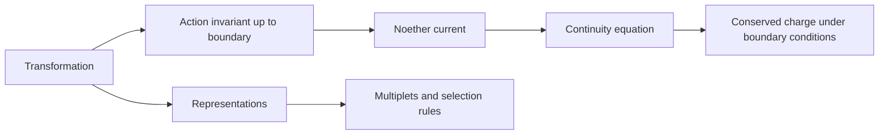

# Symmetry Conservation and Noether Map

| Continuous transformation | Conserved quantity or current | Typical setting |
|---|---|---|
| time translation | energy | isolated time-independent dynamics |
| spatial translation | linear momentum | homogeneous space |
| rotation | angular momentum | isotropic space |
| Lorentz transformation | angular-momentum tensor and boost charges | relativistic field theory |
| global internal phase | charge or particle number | complex fields when symmetry is exact |
| spacetime diffeomorphism redundancy | covariant identities and constraints | general relativity |

Gauge transformations are redundancies of representation; global transformations may act physically on states. Boundary terms, anomalies, explicit breaking, spontaneous breaking, and open-system exchange all modify naive conservation statements.

Navigate: [[Symmetry in Physics]] · [[Noethers Theorem in Mechanics]] · [[Group Theory]] · [[Gauge Symmetry]] · [[Spontaneous Symmetry Breaking]]
