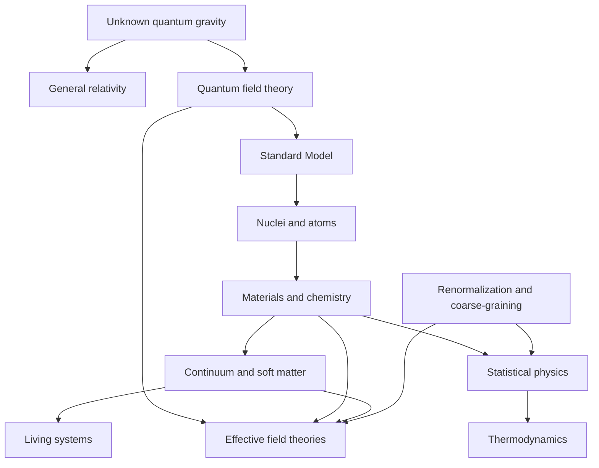

# Unification and Emergence Map

Unification reduces apparently different phenomena to shared degrees of freedom and symmetries. Emergence explains why higher-level structures have stable laws despite microscopic complexity. Physics needs both directions.

## Established reductions

- [[Maxwell Equations|Maxwell electromagnetism]] unifies electricity, magnetism, and light.
- [[Principle of Relativity|Special relativity]] unifies space and time; [[Quantum Field Theory and Particle Physics Map|relativistic field theory]] combines it with quantum mechanics for nongravitational interactions.
- [[Statistical Physics Map|Statistical mechanics]] accounts for broad equilibrium [[Thermodynamics Map|thermodynamics]] under specified assumptions.
- Atomic and [[Condensed Matter Physics Map|condensed-matter]] behavior follows [[Quantum Mechanics Map|quantum mechanics]] in principle, while exact many-body prediction is usually intractable.

## Incomplete or open bridges

- [[Quantum Field Theory and Particle Physics Map|quantum field theory]] ↔ [[Quantum Gravity|dynamical spacetime]];
- microscopic reversibility ↔ [[Arrow of Time|thermodynamic arrow]] and [[Initial and Boundary Conditions|cosmological initial conditions]];
- [[Quantum Chromodynamics|QCD]] ↔ quantitative [[Nuclear Physics Map|nuclear structure]] across the chart;
- neural or molecular dynamics ↔ multiscale [[Biophysics Map|biological function]];
- constituent rules ↔ universal [[Nonequilibrium Steady States|far-from-equilibrium organization]].

## Do not confuse

- “derivable in principle” with “predictable in practice”;
- universality with microscopic identity;
- mathematical duality with empirical equivalence;
- analogy with mechanism;
- coarse-graining with ignorance alone.

Navigate: [[Effective Theories]] · [[Emergence]] · [[Reduction and Universality]] · [[Renormalization Group]] · [[Scale Ladder]] · [[Approximation and Regime Map]]
