# Computational Lab Gallery

These figures were regenerated by the validated quick-mode suite. The numerical arrays and tables beside them are retained under `results/all_labs`.

[[Computational Lab Index]] · [[Computational Physics Map]] · [[Derivation Atlas]]

## Mechanics

### Projectile and symplectic integration

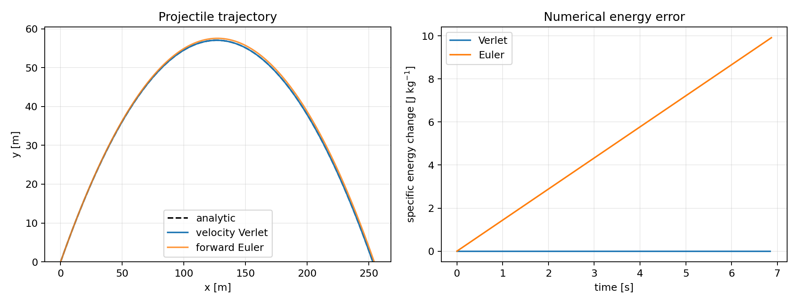

### Sun–Earth–Jupiter N-body dynamics

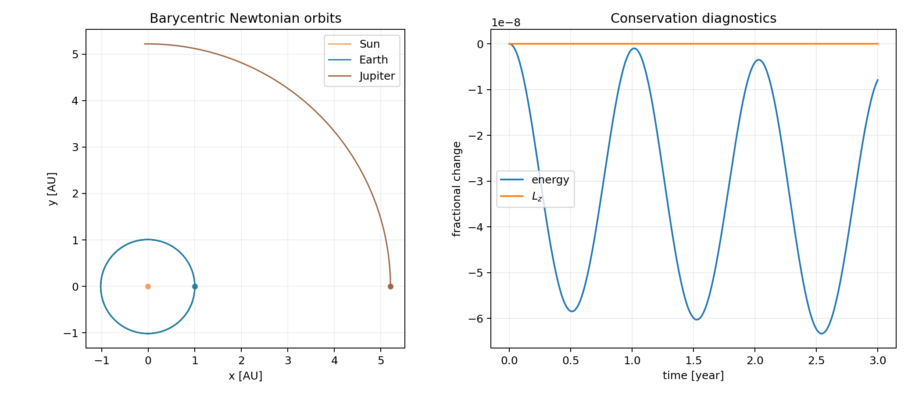

### Coupled oscillators and normal modes

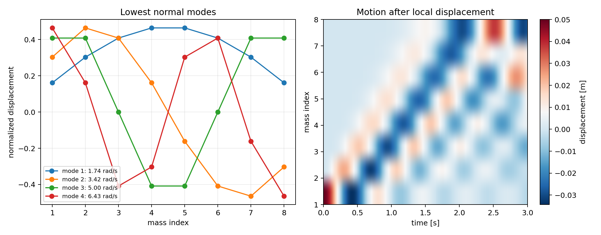

## Fields and continua

### Electrostatic Laplace solver

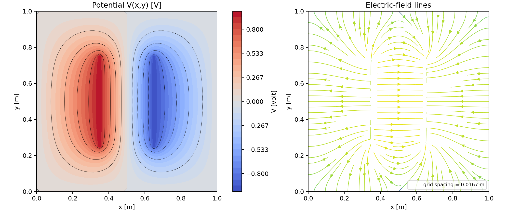

### Wave-equation FDTD

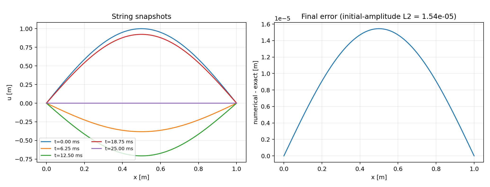

### Heat diffusion

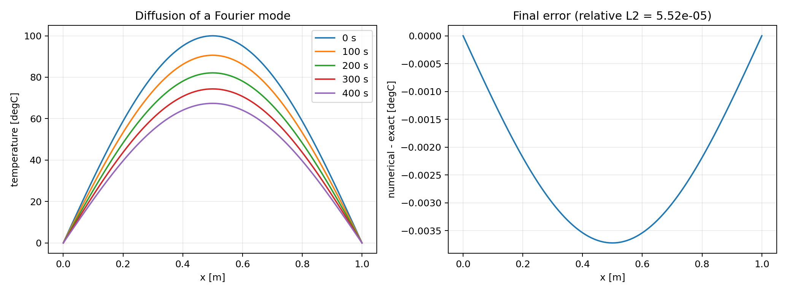

## Quantum and statistical physics

### Infinite-well spectrum and unitary wave-packet evolution

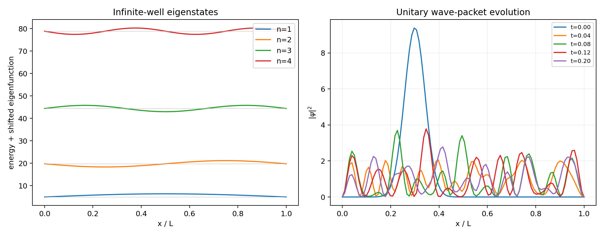

### Two-dimensional Ising Monte Carlo

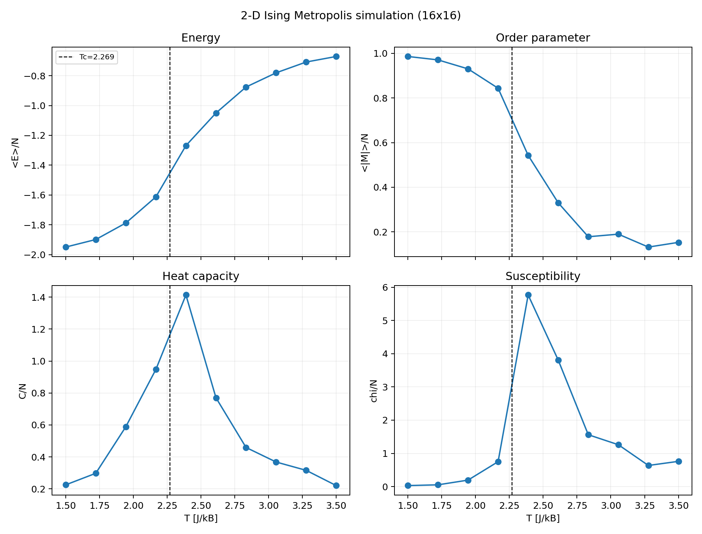

### Random walks and diffusion

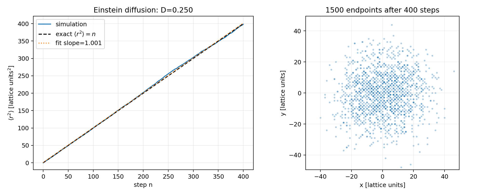

## Nonlinear dynamics, relativity, cosmology, and inference

### Lorenz chaos

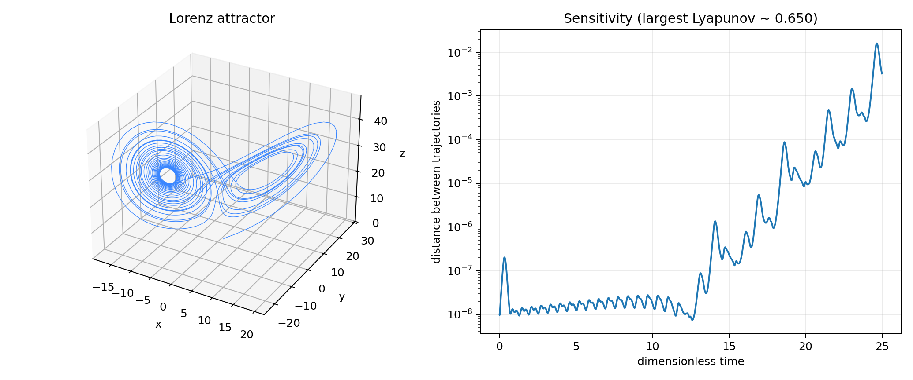

### Special relativity

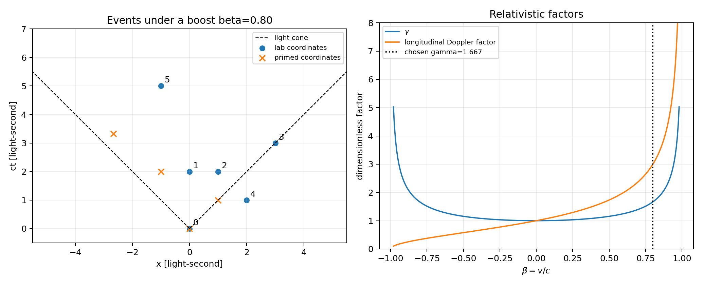

### Friedmann cosmology

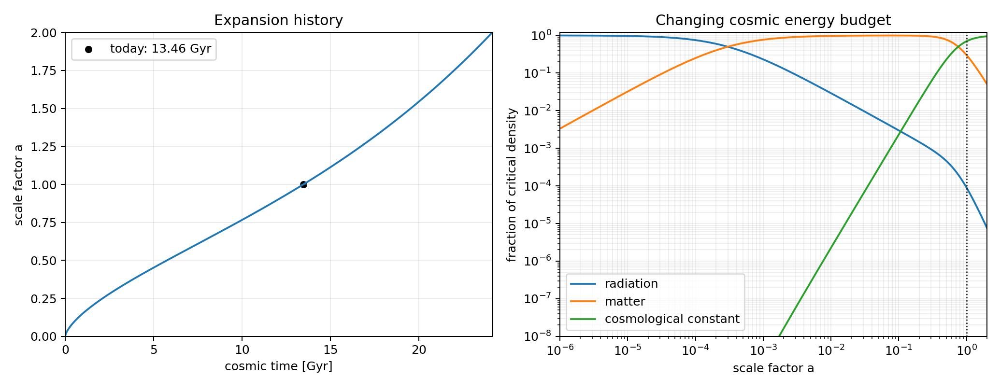

### Weighted fitting and uncertainty

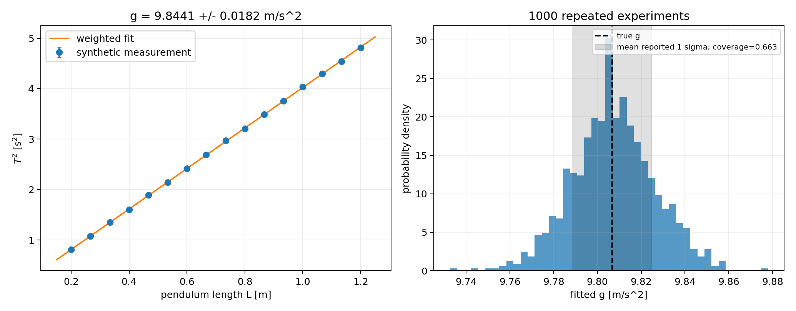

## Scientific use

The plots are checks, not proofs. Change one assumption, predict the qualitative effect first, rerun, and add a validation that would fail if the implementation were wrong.
