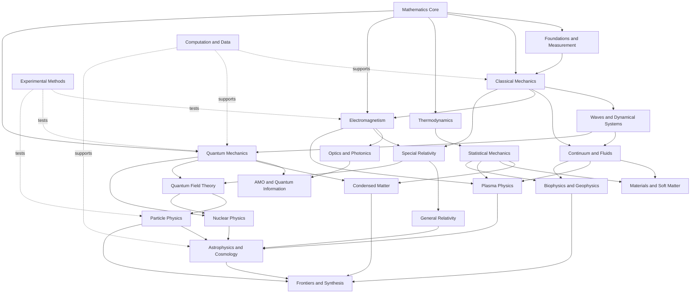

# Architecture and Completeness Audit

[[Physics Worldmap]] · [[Learning Paths]] · [[Open Problems Dashboard]]

> [!note] Blueprint versus implemented vault
> The taxonomy below is the original design specification. The released vault implements the same layers with shorter numbered folders such as `00 Start`, `01 Atlas`, `62 Computational Labs`, and `80 Frontiers`. For the active metadata vocabulary, use [[Epistemic Status and Claim Hygiene]] and [[Source and Citation Policy]]; the longer status list below remains a design reference, not the validator's current schema.

## Physics Worldmap — Taxonomy and Curriculum Specification

This document is the organizing blueprint for an Obsidian vault intended to function as a durable, navigable “second brain” for physics. It is not a claim that physics can be completed once and for all. The vault should distinguish what is exact, approximate, empirically established, model-dependent, computationally known, conjectural, and genuinely open.

## 1. Design principles

1. **Maps before details.** Every major field has an `MOC — …` map-of-content note that explains scope, prerequisites, neighboring fields, governing theories, characteristic scales, canonical experiments, and open problems.
2. **Atomic but connected notes.** A concept, theorem, equation, experiment, method, dataset, or open problem gets its own note when it can be reused in more than one context.
3. **Prerequisites are explicit.** Every technical note links to the minimum prior notes needed to understand or derive it.
4. **Equations carry meaning.** Each important equation note records variables, dimensions, assumptions, derivation route, limiting cases, symmetries, conserved quantities, solution methods, experimental tests, and failure regime.
5. **Evidence is first-class.** Theory notes link to experiment and observation notes; experiment notes link to apparatus, calibration, uncertainty, datasets, analysis methods, and competing interpretations.
6. **Scale and regime are explicit.** Every model states relevant length, time, energy, temperature, density, velocity, and coupling regimes.
7. **“Solved” is qualified.** A problem can be analytically solved, numerically controlled, experimentally settled, effectively modeled, or open in different senses.
8. **Frontiers link backward.** Every open-problem note links to the established results that constrain it and to the methods most likely to advance it.
9. **Multiple explanations coexist.** A concept may have intuitive, mathematical, historical, computational, and experimental views, linked rather than collapsed.
10. **Synthesis is an activity.** Cross-field connection notes must state whether a link is an identity, analogy, shared mathematics, shared symmetry, limiting relation, duality, heuristic, or speculation.

## 2. Recommended vault structure

Folder names provide browsing order; Wikilinks provide the actual knowledge graph.

```text
00 Atlas and Navigation/
01 Mathematics/
02 Foundations and Metrology/
03 Classical Mechanics/
04 Waves Nonlinear Dynamics and Acoustics/
05 Continuum Mechanics and Fluids/
06 Thermodynamics and Statistical Physics/
07 Electromagnetism Optics and Photonics/
08 Relativity and Gravitation/
09 Quantum Mechanics and Quantum Foundations/
10 Atomic Molecular and Optical Physics/
11 Condensed Matter Materials and Soft Matter/
12 Nuclear Physics/
13 Particle Physics and Quantum Field Theory/
14 Plasma Physics and Fusion/
15 Astrophysics and Cosmology/
16 Interdisciplinary Physics/
17 Computation Data and Simulation/
18 Experimental Methods and Instruments/
19 History People and Institutions/
20 Frontiers Open Problems and Synthesis/
90 Sources and Reading Notes/
91 Datasets and Reproducible Projects/
92 Derivations and Worked Problems/
93 Code and Notebooks/
99 Templates and Assets/
```

### Note-type naming

- `MOC — Field Name`
- `Equation — Name`
- `Experiment — Name`
- `Method — Name`
- `Instrument — Name`
- `Dataset — Name`
- `Derivation — Result`
- `Simulation — System`
- `Open Problem — Name`
- `Connection — A and B`
- `Biography — Person`
- `Reading — Author Year Short Title`

Ordinary concept notes should use the canonical concept name without a prefix: for example, `Noether's Theorem`, `Gauge Symmetry`, or `Renormalization Group`.

### Minimal frontmatter

```yaml
---
type: concept              # concept | equation | experiment | method | open-problem | moc
area: quantum-mechanics
status: established        # see epistemic scheme below
maturity: seed             # seed | developing | reviewed | reference
prerequisites:
  - Linear Operators
related:
  - Spectral Theorem
scales:
  energy: null
  length: null
evidence:
  - Experiment — Stern–Gerlach
open_questions: []
sources: []
last_reviewed: YYYY-MM-DD
---
```

## 3. Epistemic status and “solvedness”

Use two independent fields: `status` describes confidence; `solution_state` describes tractability.

### Evidence status

| Status | Meaning |
|---|---|
| `definition` | A convention, formal definition, or taxonomy rather than an empirical claim. |
| `mathematical-result` | Proven under stated assumptions. |
| `established` | Repeatedly tested and accepted within a stated empirical regime. |
| `effective-theory` | Predictively successful inside a known scale or parameter range. |
| `precision-limited` | Established in form but limited by measurement or calculation precision. |
| `active-research` | Evidence exists, but important interpretation or parameter questions remain. |
| `conjectural` | Mathematically or physically motivated but not empirically established. |
| `controversial` | Live disagreement persists over evidence, interpretation, or methodology. |
| `disfavored` | Strongly constrained or superseded, but historically or logically useful. |
| `falsified-in-regime` | Conflicts with evidence in the explicitly recorded regime. |
| `open` | A well-posed unanswered question. |

### Solution state

| State | Meaning |
|---|---|
| `closed-form` | An explicit analytic solution exists under the stated assumptions. |
| `integrable` | Enough conserved structure exists for exact solution in principle. |
| `asymptotic` | Controlled expansion exists in a stated limit. |
| `perturbative` | A controlled expansion exists in a small parameter. |
| `numerically-controlled` | Converged computation with quantified errors is available. |
| `phenomenological` | A fitted or effective description predicts data without full microscopic derivation. |
| `existence-known` | Existence or qualitative behavior is established without constructive solution. |
| `undecidable-currently` | Present theory/data cannot discriminate alternatives. |
| `open` | No accepted solution is known. |

Every “solved” claim should complete the sentence: **solved for what initial conditions, boundary conditions, observables, precision, and regime?**

## 4. Major-field taxonomy

| Major area | Representative subfields | Central objects and questions | Direct neighbors |
|---|---|---|---|
| Mathematics for physics | calculus, linear algebra, analysis, geometry, topology, probability, group theory, PDEs, numerics | What structures make physical laws expressible and solvable? | every field |
| Foundations and metrology | units, dimensional analysis, uncertainty, inference, causality, philosophy of models | What is measured, how is it inferred, and how certain is it? | experiment, statistics, quantum foundations |
| Classical mechanics | Newtonian, Lagrangian, Hamiltonian, rigid body, celestial mechanics | How do configurations evolve under forces and constraints? | waves, fluids, relativity, quantum mechanics |
| Dynamical systems | stability, bifurcations, chaos, ergodicity, control | What qualitative behaviors follow from evolution laws? | mechanics, climate, plasma, biology |
| Waves and acoustics | normal modes, dispersion, scattering, sound, solitons | How do disturbances propagate, interfere, localize, and decay? | optics, quantum, fluids, seismology |
| Continuum mechanics | elasticity, plasticity, fracture, rheology, granular matter | How do extended media deform and fail? | materials, geophysics, soft matter |
| Fluid dynamics | incompressible, compressible, geophysical, turbulence, multiphase | How do flowing continua organize across scales? | plasma, climate, astrophysics |
| Thermodynamics | equilibrium, engines, phase changes, nonequilibrium thermodynamics | What constraints follow from energy, entropy, and reservoirs? | statistical physics, chemistry, information |
| Statistical physics | ensembles, phase transitions, critical phenomena, stochastic processes | How do collective laws emerge from many degrees of freedom? | condensed matter, biophysics, gravity |
| Electromagnetism | electrostatics, magnetostatics, electrodynamics, radiation, circuits | How do charges, currents, and fields interact? | optics, plasma, relativity, QED |
| Optics and photonics | geometric, wave, Fourier, nonlinear, quantum optics | How is electromagnetic radiation generated, guided, and measured? | AMO, information, instrumentation |
| Special relativity | Lorentz symmetry, relativistic dynamics, relativistic fields | How do laws and causality transform between inertial frames? | electromagnetism, QFT, gravitation |
| Gravitation and GR | differential geometry, black holes, gravitational waves, numerical relativity | How does stress-energy shape spacetime? | cosmology, astrophysics, quantum gravity |
| Quantum mechanics | states, observables, measurement, approximation, scattering | How are amplitudes assigned and observations predicted? | AMO, condensed matter, nuclear, QFT |
| Quantum foundations and information | interpretations, entanglement, computation, sensing | What operational structure distinguishes quantum theory? | information theory, gravity, AMO |
| AMO physics | atomic structure, molecules, lasers, spectroscopy, cold atoms | How do few-body quantum systems bind, radiate, and permit control? | chemistry, metrology, quantum technology |
| Condensed matter | electronic structure, magnetism, superconductivity, topology | How do many-body phases and quasiparticles emerge in matter? | materials, quantum information, stat mech |
| Materials and soft matter | polymers, colloids, liquid crystals, defects, nanoscience | How do structure and processing determine response? | engineering, biology, continuum mechanics |
| Nuclear physics | nuclear structure, reactions, decay, hadrons, nuclear matter | How do protons and neutrons form nuclei and dense matter? | particle physics, astrophysics, energy |
| Particle physics | Standard Model, flavor, neutrinos, collider physics, beyond-SM | What are the elementary fields and interactions? | QFT, cosmology, nuclear physics |
| Quantum field theory | fields, gauge theory, renormalization, EFT, nonperturbative methods | How are quantum theory and locality combined across scales? | particle, condensed matter, gravity |
| Plasma physics | kinetic theory, MHD, waves, instabilities, space plasma | How do ionized collective media behave? | fusion, astrophysics, fluids, EM |
| Astrophysics | stars, compact objects, galaxies, high-energy and multi-messenger astronomy | How do physical laws generate observed cosmic objects? | nuclear, plasma, gravity, observation |
| Cosmology | expansion, early universe, structure formation, dark sectors | What is the history, content, geometry, and fate of the universe? | GR, particle physics, statistics |
| Biophysics and chemical physics | molecular dynamics, membranes, networks, active matter | How do physical principles constrain living and chemical systems? | soft matter, nonequilibrium physics |
| Geophysics and climate physics | seismology, interiors, atmosphere, oceans, climate | How do planetary systems transport matter and energy? | fluids, thermodynamics, inverse problems |
| Computational physics | numerical analysis, simulation, HPC, scientific ML | How can controlled computation expose consequences of models? | every field |
| Experimental physics | instrumentation, electronics, vacuum, cryogenics, detectors | How are physical quantities prepared, controlled, and measured? | every empirical field |
| Synthesis and frontiers | emergence, unification, analogies, open problems, theory design | Which cross-field structures are real, useful, or testable? | every field |

## 5. Prerequisite graph

The graph is intentionally a directed acyclic learning map, not a claim that research itself is linear.



### Minimum prerequisite bundles

| Destination | Minimum bundle |
|---|---|
| Analytical mechanics | vectors, multivariable calculus, ODEs, Newtonian mechanics |
| Electrodynamics | vector calculus, PDE basics, waves, special relativity helpful |
| Statistical mechanics | probability, thermodynamics, multivariable calculus, mechanics or quantum basics |
| General relativity | special relativity, tensor calculus, differential geometry, variational principles |
| Graduate quantum mechanics | linear algebra, complex analysis basics, Fourier analysis, classical waves, Hamiltonian mechanics |
| Quantum field theory | graduate quantum mechanics, special relativity, classical field theory, distributions, group theory |
| Condensed matter | quantum mechanics, statistical mechanics, electromagnetism, Fourier methods |
| Nuclear physics | quantum mechanics, scattering, angular momentum, special relativity; QFT for advanced topics |
| Particle physics | special relativity, quantum mechanics, group representations, QFT |
| Plasma physics | electromagnetism, fluid dynamics, kinetic theory, waves |
| Astrophysics | mechanics, EM, thermo/stat mech, fluids, quantum/nuclear basics |
| Cosmology | general relativity, statistical mechanics, field theory basics, inference |
| Quantum information | quantum mechanics, linear algebra, probability, information theory |
| Computational field work | numerical linear algebra, ODE/PDE methods, error analysis, reproducible computing |

## 6. Curriculum and mastery levels

Progress is spiral-shaped: each level revisits earlier ideas with more mathematical power and better evidence.

### Level 0 — Orientation and physical literacy

**Goal:** Read physical claims critically and estimate orders of magnitude.

- Units, dimensions, vectors, graphs, uncertainty, significant figures.
- Energy, momentum, force, fields, waves, temperature, atoms, spacetime.
- Scale tours from Planck length to observable universe.
- Basic scientific programming and plotting.
- Mastery artifact: `Project — Powers of Ten Physics Atlas` with linked estimates and sources.

### Level 1 — Mathematical and experimental foundations

**Goal:** Translate simple physical situations into equations and measurements.

- Single and multivariable calculus, linear algebra, ODEs, complex numbers.
- Probability, distributions, fitting, Bayesian and frequentist viewpoints.
- Sensors, calibration, error propagation, reproducible notebooks.
- Mastery artifacts: pendulum experiment; RC-circuit experiment; numerical projectile model; uncertainty budget.

### Level 2 — Undergraduate core

**Goal:** Solve standard problems and recognize shared conservation and wave structures.

- Newtonian mechanics, oscillations, waves, special relativity.
- Thermodynamics and introductory statistical mechanics.
- Electricity and magnetism, circuits, geometric and wave optics.
- Introductory quantum mechanics and atomic structure.
- Mastery artifact: one derivation map linking `Noether's Theorem`, `Conservation of Energy`, `Wave Equation`, `Maxwell's Equations`, and `Schrödinger Equation`.

### Level 3 — Advanced undergraduate synthesis

**Goal:** Use variational, field, statistical, and computational methods across domains.

- Lagrangian and Hamiltonian mechanics; nonlinear dynamics.
- Electrodynamics and radiation; continuum mechanics and fluids.
- Quantum angular momentum, approximation, scattering, identical particles.
- Statistical ensembles, phase transitions, transport.
- Solid-state, nuclear, particle, plasma, astrophysics surveys.
- Mastery artifacts: reproduce a landmark result from public data; implement three independent solvers for one system and compare errors.

### Level 4 — Graduate core

**Goal:** Work fluently with modern formalism and controlled approximations.

- Advanced classical mechanics, electrodynamics, quantum mechanics, statistical mechanics.
- General relativity and classical field theory.
- QFT foundations, renormalization, gauge theory, effective field theory.
- Advanced computation: spectral methods, Monte Carlo, inverse problems, uncertainty quantification.
- Mastery artifact: a “regime map” showing where a chosen theory is exact, perturbative, numerical, phenomenological, or unknown.

### Level 5 — Specialization

**Goal:** Reach research-paper literacy in two adjacent areas.

- Choose a primary track and a neighboring track.
- Build annotated reading chains: review → textbook chapters → landmark papers → current papers.
- Reproduce at least one published figure or calculation from open data/code.
- Maintain `MOC — Methods Transfer` to record techniques reusable across tracks.

### Level 6 — Frontier literacy

**Goal:** State open questions precisely and know existing constraints.

- For each open problem: definition, why it matters, current bounds, known no-go results, active approaches, discriminating observations, and failure criteria.
- Separate “unknown parameter” from “unknown mechanism,” “computationally hard” from “conceptually incomplete,” and “untested” from “unfalsifiable.”
- Mastery artifact: a reviewed `Open Problem Dossier Template` completed for three problems in different fields.

### Level 7 — Synthesis and theory generation

**Goal:** Generate disciplined, testable connections without confusing analogy for evidence.

Every proposed connection must answer:

1. What exact structures are being related?
2. Is the relation a limit, duality, symmetry, mapping, universality class, shared equation, or analogy?
3. What known result does it reproduce?
4. What new quantitative prediction follows?
5. What observation or computation could falsify it?
6. Does it violate a conservation law, bound, no-go theorem, or existing precision test?
7. What is the smallest model that isolates the claim?

## 7. Canonical concepts and equations

Each item below should become a hub linking derivation, interpretation, solutions, limits, experiments, and applications.

| Area | Canonical equation or structure | Core concepts and links |
|---|---|---|
| Measurement | \(z=(x-\mu)/\sigma\), covariance propagation, Bayes’ theorem | `Uncertainty`, `Likelihood`, `Calibration`, `Model Selection` |
| Newtonian mechanics | \(\mathbf F=d\mathbf p/dt\) | `Inertial Frame`, `Momentum`, `Work–Energy Theorem`, `Angular Momentum` |
| Analytical mechanics | \(\frac{d}{dt}\frac{\partial L}{\partial \dot q_i}-\frac{\partial L}{\partial q_i}=0\) | `Action Principle`, `Generalized Coordinates`, `Noether's Theorem` |
| Hamiltonian mechanics | \(\dot q_i=\partial H/\partial p_i,\ \dot p_i=-\partial H/\partial q_i\) | `Phase Space`, `Poisson Bracket`, `Canonical Transformation` |
| Waves | \(\partial_t^2\psi=c^2\nabla^2\psi\) | `Normal Modes`, `Green's Functions`, `Dispersion Relation`, `Scattering` |
| Nonlinear dynamics | \(\dot{\mathbf x}=\mathbf f(\mathbf x,\lambda)\) | `Fixed Point`, `Stability`, `Bifurcation`, `Lyapunov Exponent`, `Chaos` |
| Elasticity | \(\sigma_{ij}=C_{ijkl}\epsilon_{kl}\) | `Stress Tensor`, `Strain Tensor`, `Defects`, `Fracture` |
| Fluids | \(\rho D\mathbf v/Dt=-\nabla p+\mu\nabla^2\mathbf v+\mathbf f\) | `Navier–Stokes Equations`, `Vorticity`, `Boundary Layer`, `Turbulence` |
| Thermodynamics | \(dU=T\,dS-p\,dV+\sum_i\mu_i\,dN_i\) | `State Function`, `Entropy`, `Free Energy`, `Chemical Potential` |
| Statistical mechanics | \(Z=\mathrm{Tr}\,e^{-\beta H}\) | `Ensemble`, `Partition Function`, `Fluctuation–Dissipation Theorem` |
| Stochastic physics | \(\partial_tP=-\partial_i(A_iP)+\frac12\partial_i\partial_j(B_{ij}P)\) | `Fokker–Planck Equation`, `Langevin Equation`, `Brownian Motion` |
| Electromagnetism | \(\partial_\mu F^{\mu\nu}=\mu_0J^\nu,\ \partial_{[\alpha}F_{\beta\gamma]}=0\) | `Maxwell's Equations`, `Gauge Potential`, `Lorentz Force`, `Radiation` |
| Optics | \(k_\mu k^\mu=0\), eikonal and paraxial equations | `Fermat's Principle`, `Diffraction`, `Polarization`, `Coherence` |
| Special relativity | \(ds^2=\eta_{\mu\nu}dx^\mu dx^\nu\), \(E^2=p^2c^2+m^2c^4\) | `Lorentz Transformation`, `Proper Time`, `Causality` |
| General relativity | \(G_{\mu\nu}+\Lambda g_{\mu\nu}=8\pi G T_{\mu\nu}/c^4\) | `Equivalence Principle`, `Curvature`, `Geodesic`, `Black Hole` |
| Quantum mechanics | \(i\hbar\partial_t|\psi\rangle=\hat H|\psi\rangle\) | `Hilbert Space`, `Observable`, `Born Rule`, `Commutator` |
| Quantum dynamics | \([A,B]\), path integral, density operator | `Uncertainty Principle`, `Propagator`, `Decoherence`, `Open Quantum System` |
| AMO physics | central-field Hamiltonian and dipole coupling \(-\mathbf d\cdot\mathbf E\) | `Atomic Orbitals`, `Selection Rules`, `Rabi Oscillation`, `Laser Cooling` |
| Quantum information | \(\rho\mapsto\mathcal E(\rho)\), von Neumann entropy \(S=-\mathrm{Tr}\rho\ln\rho\) | `Qubit`, `Entanglement`, `Quantum Channel`, `Quantum Error Correction` |
| Condensed matter | Bloch eigenproblem; \(E_n(\mathbf k)\) | `Band Structure`, `Fermi Surface`, `Quasiparticle`, `Order Parameter` |
| Critical phenomena | \(\xi\sim |t|^{-\nu}\), RG flow \(dg_i/d\ln b=\beta_i\) | `Universality`, `Scaling`, `Renormalization Group`, `Fixed Point` |
| Superconductivity | BCS gap equation; Ginzburg–Landau functional | `Cooper Pair`, `Spontaneous Symmetry Breaking`, `Meissner Effect` |
| Nuclear physics | \(N=N_0e^{-\lambda t}\); liquid-drop mass formula | `Binding Energy`, `Nuclear Shell Model`, `Nuclear Reaction`, `Radioactive Decay` |
| QFT | \(\mathcal Z=\int\mathcal D\phi\,e^{iS[\phi]/\hbar}\) | `Quantum Field`, `Feynman Diagram`, `Renormalization`, `Effective Field Theory` |
| Gauge theory | \(D_\mu=\partial_\mu-igA_\mu^aT^a\) | `Local Gauge Symmetry`, `Yang–Mills Theory`, `Standard Model` |
| Plasma kinetic theory | \(\partial_tf+\mathbf v\cdot\nabla f+\frac qm(\mathbf E+\mathbf v\times\mathbf B)\cdot\nabla_v f=C[f]\) | `Vlasov Equation`, `Debye Screening`, `Landau Damping` |
| Magnetohydrodynamics | mass, momentum, induction, and energy equations | `Frozen-In Flux`, `Alfvén Wave`, `Magnetic Reconnection` |
| Stellar structure | hydrostatic equilibrium, mass continuity, energy transport and generation | `Virial Theorem`, `Opacity`, `Nucleosynthesis`, `Stellar Evolution` |
| Cosmology | \(H^2=\frac{8\pi G}{3}\rho-\frac{kc^2}{a^2}+\frac{\Lambda c^2}{3}\) | `Friedmann Equations`, `Cosmic Expansion`, `Inflation`, `Structure Formation` |
| Transport | \(\mathbf J=-D\nabla n\), Boltzmann transport equation | `Diffusion`, `Viscosity`, `Conductivity`, `Mean Free Path` |
| Information and emergence | entropy, mutual information, coarse-graining | `Information Theory`, `Emergence`, `Complexity`, `Universality` |

## 8. Landmark experiments and observations

These are anchor notes, not a complete history. Each experiment note should include apparatus, measured observable, uncertainty, result, theoretical alternatives, replications, and modern status.

| Domain | Landmarks | What they establish or constrain |
|---|---|---|
| Mechanics and gravity | `Experiment — Galileo Inclined Plane`, `Experiment — Cavendish Torsion Balance`, `Experiment — Foucault Pendulum`, `Experiment — Eötvös Equivalence Tests` | acceleration laws, \(G\), Earth’s rotation, equivalence principle |
| Thermodynamics and atoms | `Experiment — Joule Mechanical Equivalent of Heat`, `Experiment — Perrin Brownian Motion`, `Experiment — Millikan Oil Drop`, `Experiment — Stern–Gerlach` | energy equivalence, atomism, charge quantization, angular momentum quantization |
| Electromagnetism | `Experiment — Coulomb Torsion Balance`, `Experiment — Oersted Current and Compass`, `Experiment — Faraday Induction`, `Experiment — Hertz Radio Waves` | inverse-square force, current–magnetism link, induction, electromagnetic waves |
| Optics | `Experiment — Young Double Slit`, `Experiment — Michelson Interferometer`, `Experiment — Fizeau Speed of Light`, `Experiment — Hanbury Brown and Twiss` | interference, precision phase measurement, finite light speed, photon correlations |
| Special relativity | `Experiment — Michelson–Morley`, `Experiment — Kennedy–Thorndike`, `Experiment — Ives–Stilwell`, `Experiment — Muon Lifetime Dilation` | Lorentz symmetry and relativistic time/energy relations |
| General relativity | `Observation — Eddington Eclipse Deflection`, `Experiment — Pound–Rebka`, `Experiment — Gravity Probe B`, `Observation — Binary Pulsar Hulse–Taylor`, `Observation — LIGO GW150914` | light bending, gravitational redshift, frame effects, radiative gravity, gravitational waves |
| Quantum origins | `Experiment — Photoelectric Effect`, `Experiment — Compton Scattering`, `Experiment — Franck–Hertz`, `Experiment — Davisson–Germer` | photons, photon momentum, atomic levels, matter waves |
| Quantum foundations | `Experiment — Aspect Bell Test`, `Experiment — Delayed Choice`, `Experiment — Quantum Eraser`, `Experiment — Loophole-Free Bell Test` | nonclassical correlations and constraints on hidden-variable models |
| AMO | `Experiment — Lamb Shift`, `Experiment — Ramsey Separated Oscillatory Fields`, `Experiment — First Bose–Einstein Condensate`, `Experiment — Optical Clock Comparison` | radiative corrections, precision spectroscopy, quantum degeneracy, metrology |
| Condensed matter | `Experiment — Hall Effect`, `Experiment — Meissner Effect`, `Experiment — Integer Quantum Hall Effect`, `Experiment — Graphene Isolation`, `Experiment — ARPES Band Mapping` | charge transport, superconductivity, topology, 2D materials, electronic structure |
| Nuclear physics | `Experiment — Rutherford Scattering`, `Experiment — Chadwick Neutron Discovery`, `Experiment — Nuclear Fission`, `Experiment — Reines–Cowan Neutrino Detection`, `Experiment — Deep Inelastic Scattering` | nucleus, neutron, fission, neutrino interaction, partons |
| Particle physics | `Experiment — Positron Discovery`, `Experiment — Wu Parity Violation`, `Experiment — Neutral Current Discovery`, `Experiment — W and Z Discovery`, `Experiment — Higgs Boson Discovery` | antimatter, weak parity violation, electroweak structure, Higgs mechanism |
| Neutrinos | `Experiment — Homestake Solar Neutrinos`, `Experiment — Super-Kamiokande Atmospheric Neutrinos`, `Experiment — SNO Flavor Change`, `Experiment — Reactor Neutrino Oscillations` | solar-neutrino discrepancy and neutrino mass/mixing |
| Plasma and fusion | `Experiment — Langmuir Probe`, `Experiment — Z-Pinch`, `Experiment — Tokamak Confinement`, `Experiment — Inertial Confinement Ignition` | plasma diagnostics, instabilities, magnetic confinement, fusion burn |
| Astrophysics | `Observation — H–R Diagram`, `Observation — Cosmic Radio Pulsars`, `Observation — Binary Neutron Star GW170817`, `Observation — Event Horizon Telescope M87 Star`, `Observation — Exoplanet Transit` | stellar evolution, compact objects, multi-messenger physics, horizon-scale structure, planetary systems |
| Cosmology | `Observation — Hubble–Lemaître Expansion`, `Observation — Cosmic Microwave Background`, `Observation — Type Ia Supernova Acceleration`, `Observation — Baryon Acoustic Oscillations`, `Observation — CMB Anisotropies` | expansion, hot Big Bang, acceleration, standard rulers, primordial perturbations |
| Fundamental precision | `Experiment — Electron Magnetic Moment`, `Experiment — Atomic Parity Violation`, `Experiment — Neutron Electric Dipole Moment Search`, `Experiment — Equivalence Principle Satellite Test`, `Experiment — Fine-Structure Constant Comparison` | QED, electroweak physics, CP-violation bounds, gravity tests, drifting-constant bounds |

## 9. Suggested textbook and resource spine

Only bibliographic pointers and learning roles are given; do not copy copyrighted text into the vault. Store original summaries, derivations, and properly attributed short quotations.

### Broad orientation

- OpenStax, *University Physics* — open undergraduate reference.
- The Feynman Lectures on Physics — conceptual breadth; use the authorized Caltech edition.
- David Halliday, Robert Resnick, and Jearl Walker, *Fundamentals of Physics* — standard survey.
- Young and Freedman, *University Physics with Modern Physics* — standard survey and problem practice.
- Eric Mazur, *Peer Instruction* — conceptual-question methodology.

### Mathematics and computation

- Mary L. Boas, *Mathematical Methods in the Physical Sciences*.
- Riley, Hobson, and Bence, *Mathematical Methods for Physics and Engineering*.
- Arfken, Weber, and Harris, *Mathematical Methods for Physicists*.
- Sheldon Axler, *Linear Algebra Done Right*.
- Michael Spivak, *Calculus*; James Stewart, *Calculus* for a gentler problem sequence.
- Haberman, *Applied Partial Differential Equations*.
- Steven Strogatz, *Nonlinear Dynamics and Chaos*.
- Trefethen and Bau, *Numerical Linear Algebra*.
- Mark Newman, *Computational Physics* and its openly available supporting materials.
- Landau and Binder, *A Guide to Monte Carlo Simulations in Statistical Physics*.

### Mechanics, waves, and fluids

- John R. Taylor, *Classical Mechanics*.
- Kleppner and Kolenkow, *An Introduction to Mechanics*.
- David Morin, *Introduction to Classical Mechanics*.
- Goldstein, Poole, and Safko, *Classical Mechanics*.
- Landau and Lifshitz, *Mechanics*.
- A. P. French, *Vibrations and Waves*.
- L. E. Kinsler et al., *Fundamentals of Acoustics*.
- Kundu, Cohen, and Dowling, *Fluid Mechanics*.
- G. K. Batchelor, *An Introduction to Fluid Dynamics*.
- Landau and Lifshitz, *Fluid Mechanics*.

### Thermodynamics and statistical physics

- Daniel Schroeder, *An Introduction to Thermal Physics*.
- Herbert Callen, *Thermodynamics and an Introduction to Thermostatistics*.
- Frederick Reif, *Fundamentals of Statistical and Thermal Physics*.
- Pathria and Beale, *Statistical Mechanics*.
- Mehran Kardar, *Statistical Physics of Particles* and *Statistical Physics of Fields*.
- James Sethna, *Statistical Mechanics: Entropy, Order Parameters, and Complexity*; consult the authorized open edition.
- de Groot and Mazur, *Non-Equilibrium Thermodynamics*.

### Electromagnetism and optics

- Purcell and Morin, *Electricity and Magnetism*.
- David J. Griffiths, *Introduction to Electrodynamics*.
- John D. Jackson, *Classical Electrodynamics*.
- Andrew Zangwill, *Modern Electrodynamics*.
- Hecht, *Optics*.
- Goodman, *Introduction to Fourier Optics*.
- Saleh and Teich, *Fundamentals of Photonics*.
- Mandel and Wolf, *Optical Coherence and Quantum Optics*.

### Relativity and gravitation

- Edwin Taylor and John Wheeler, *Spacetime Physics*.
- Bernard Schutz, *A First Course in General Relativity*.
- James Hartle, *Gravity*.
- Sean Carroll, *Spacetime and Geometry* and authorized lecture notes.
- Robert Wald, *General Relativity*.
- Misner, Thorne, and Wheeler, *Gravitation*.
- Poisson and Will, *Gravity*.

### Quantum, AMO, and information

- Griffiths and Schroeter, *Introduction to Quantum Mechanics*.
- R. Shankar, *Principles of Quantum Mechanics*.
- Sakurai and Napolitano, *Modern Quantum Mechanics*.
- Cohen-Tannoudji, Diu, and Laloë, *Quantum Mechanics*.
- Bransden and Joachain, *Physics of Atoms and Molecules*.
- Foot, *Atomic Physics*.
- Metcalf and van der Straten, *Laser Cooling and Trapping*.
- Nielsen and Chuang, *Quantum Computation and Quantum Information*.
- Preskill, *Quantum Computation* lecture notes.
- Watrous, *The Theory of Quantum Information* and authorized notes.

### Condensed matter, materials, and soft matter

- Steven H. Simon, *The Oxford Solid State Basics*.
- Charles Kittel, *Introduction to Solid State Physics*.
- Ashcroft and Mermin, *Solid State Physics*.
- Chaikin and Lubensky, *Principles of Condensed Matter Physics*.
- Piers Coleman, *Introduction to Many-Body Physics*.
- Altland and Simons, *Condensed Matter Field Theory*.
- Marder, *Condensed Matter Physics*.
- de Gennes, *Scaling Concepts in Polymer Physics*.
- Doi, *Soft Matter Physics*.
- Nelson, *Defects and Geometry in Condensed Matter Physics*.

### Nuclear, particle, and field theory

- Kenneth Krane, *Introductory Nuclear Physics*.
- Povh et al., *Particles and Nuclei*.
- Halzen and Martin, *Quarks and Leptons*.
- David Griffiths, *Introduction to Elementary Particles*.
- Matthew Schwartz, *Quantum Field Theory and the Standard Model*.
- Peskin and Schroeder, *An Introduction to Quantum Field Theory*.
- Mark Srednicki, *Quantum Field Theory* and authorized draft.
- David Tong, freely available lecture notes on QFT, gauge theory, and related topics.
- Weinberg, *The Quantum Theory of Fields*.
- Aitchison and Hey, *Gauge Theories in Particle Physics*.

### Plasma, astrophysics, and cosmology

- Francis Chen, *Introduction to Plasma Physics and Controlled Fusion*.
- Jeffrey Freidberg, *Plasma Physics and Fusion Energy*.
- Nicholson, *Introduction to Plasma Theory*.
- Carroll and Ostlie, *An Introduction to Modern Astrophysics*.
- Rybicki and Lightman, *Radiative Processes in Astrophysics*.
- Shapiro and Teukolsky, *Black Holes, White Dwarfs, and Neutron Stars*.
- Barbara Ryden, *Introduction to Cosmology*.
- Dodelson and Schmidt, *Modern Cosmology*.
- Mukhanov, *Physical Foundations of Cosmology*.
- Binney and Tremaine, *Galactic Dynamics*.

### Experiment, data, and reference services

- John R. Taylor, *An Introduction to Error Analysis*.
- Bevington and Robinson, *Data Reduction and Error Analysis for the Physical Sciences*.
- Horowitz and Hill, *The Art of Electronics*.
- MIT OpenCourseWare and Physics LibreTexts for openly accessible course paths.
- NIST CODATA and the NIST Atomic Spectra Database for constants and evaluated data.
- Particle Data Group reviews for particle properties and standard summaries.
- arXiv, INSPIRE-HEP, NASA ADS, and HEPData for literature and data discovery.
- CERN Open Data, LIGO Open Science Center/GWOSC, SDSS, Gaia Archive, and NASA archives for reproducible projects.
- Review of Particle Physics, Living Reviews in Relativity, and Annual Review journals as review-entry points.

## 10. Manifest: 280 proposed note titles

The following titles are a minimum seed set. Each bracketed title is intended to become an Obsidian note. The manifest has **28 groups × 10 notes = 280 notes**.

### A. Atlas, epistemology, and navigation (10)

- `MOC — Physics Worldmap`
- `MOC — Scales of the Physical Universe`
- `MOC — Fundamental Interactions`
- `MOC — Conservation Laws`
- `MOC — Symmetries and Symmetry Breaking`
- `MOC — Approximation Methods`
- `MOC — Solved and Open Problems`
- `Theory Comparison Matrix`
- `Physics Note Evidence Standard`
- `Open Problem Dossier Template`

### B. Calculus and analysis (10)

- `Single-Variable Calculus`
- `Multivariable Calculus`
- `Vector Calculus`
- `Ordinary Differential Equations`
- `Partial Differential Equations`
- `Complex Analysis`
- `Fourier Analysis`
- `Laplace Transform`
- `Green's Functions`
- `Calculus of Variations`

### C. Linear algebra, geometry, and symmetry mathematics (10)

- `Vector Spaces`
- `Linear Operators`
- `Eigenvalues and Eigenvectors`
- `Spectral Theorem`
- `Tensor Algebra`
- `Differential Geometry`
- `Differential Forms`
- `Lie Groups and Lie Algebras`
- `Representation Theory`
- `Topology for Physics`

### D. Probability, inference, and numerical mathematics (10)

- `Probability Distributions`
- `Bayes' Theorem`
- `Likelihood and Estimation`
- `Monte Carlo Methods`
- `Markov Chains`
- `Stochastic Processes`
- `Numerical Linear Algebra`
- `Numerical ODE Methods`
- `Numerical PDE Methods`
- `Optimization and Inverse Problems`

### E. Foundations, measurement, and metrology (10)

- `SI Units and Physical Constants`
- `Dimensional Analysis`
- `Order-of-Magnitude Estimation`
- `Measurement Uncertainty`
- `Error Propagation`
- `Calibration`
- `Signal-to-Noise Ratio`
- `Causality in Physics`
- `Model Validation`
- `Reproducibility in Physics`

### F. Newtonian and rigid-body mechanics (10)

- `Newton's Laws`
- `Inertial Frames`
- `Work–Energy Theorem`
- `Linear Momentum`
- `Angular Momentum`
- `Central Force Motion`
- `Two-Body Problem`
- `Rigid-Body Dynamics`
- `Non-Inertial Frames`
- `Celestial Mechanics`

### G. Analytical mechanics and dynamical systems (10)

- `Action Principle`
- `Lagrangian Mechanics`
- `Euler–Lagrange Equations`
- `Hamiltonian Mechanics`
- `Hamilton–Jacobi Theory`
- `Poisson Brackets`
- `Canonical Transformations`
- `Noether's Theorem`
- `Phase Space`
- `Liouville's Theorem`

### H. Oscillations, waves, and acoustics (10)

- `Simple Harmonic Oscillator`
- `Coupled Oscillators`
- `Normal Modes`
- `Wave Equation`
- `Dispersion Relation`
- `Phase and Group Velocity`
- `Interference`
- `Diffraction`
- `Acoustic Waves`
- `Wave Scattering`

### I. Nonlinear dynamics and chaos (10)

- `Nonlinear Oscillator`
- `Fixed Points and Stability`
- `Bifurcation Theory`
- `Limit Cycles`
- `Lyapunov Exponents`
- `Deterministic Chaos`
- `Strange Attractors`
- `KAM Theory`
- `Solitons`
- `Synchronization`

### J. Continuum mechanics and fluid dynamics (10)

- `Continuum Hypothesis`
- `Stress and Strain`
- `Elasticity`
- `Plasticity`
- `Fracture Mechanics`
- `Navier–Stokes Equations`
- `Vorticity`
- `Boundary Layers`
- `Turbulence`
- `Compressible Flow`

### K. Thermodynamics (10)

- `Zeroth Law of Thermodynamics`
- `First Law of Thermodynamics`
- `Second Law of Thermodynamics`
- `Third Law of Thermodynamics`
- `Entropy`
- `Thermodynamic Potentials`
- `Chemical Potential`
- `Maxwell Relations`
- `Heat Engines`
- `Phase Equilibrium`

### L. Statistical mechanics and nonequilibrium physics (10)

- `Microcanonical Ensemble`
- `Canonical Ensemble`
- `Grand Canonical Ensemble`
- `Partition Function`
- `Boltzmann Distribution`
- `Quantum Statistics`
- `Phase Transitions`
- `Critical Phenomena`
- `Fluctuation–Dissipation Theorem`
- `Nonequilibrium Statistical Mechanics`

### M. Electromagnetism and electrodynamics (10)

- `Coulomb's Law`
- `Electric Potential`
- `Gauss's Law`
- `Magnetic Fields`
- `Faraday's Law`
- `Ampère–Maxwell Law`
- `Maxwell's Equations`
- `Lorentz Force`
- `Electromagnetic Radiation`
- `Gauge Potential`

### N. Optics and photonics (10)

- `Geometric Optics`
- `Fermat's Principle`
- `Polarization`
- `Fourier Optics`
- `Optical Coherence`
- `Lasers`
- `Nonlinear Optics`
- `Fiber Optics`
- `Cavities and Resonators`
- `Quantum Optics`

### O. Special relativity and relativistic mechanics (10)

- `Principle of Relativity`
- `Lorentz Transformations`
- `Minkowski Spacetime`
- `Proper Time`
- `Relativity of Simultaneity`
- `Relativistic Energy and Momentum`
- `Four-Vectors`
- `Relativistic Electrodynamics`
- `Causal Structure`
- `Twin Paradox`

### P. General relativity and gravitation (10)

- `Equivalence Principle`
- `Metric Tensor`
- `Covariant Derivative`
- `Geodesics`
- `Spacetime Curvature`
- `Einstein Field Equations`
- `Schwarzschild Geometry`
- `Kerr Geometry`
- `Gravitational Waves`
- `Numerical Relativity`

### Q. Quantum foundations and formalism (10)

- `Quantum State`
- `Hilbert Space`
- `Quantum Observables`
- `Born Rule`
- `Schrödinger Equation`
- `Commutation Relations`
- `Uncertainty Principle`
- `Quantum Measurement`
- `Entanglement`
- `Bell's Theorem`

### R. Quantum methods and many-particle basics (10)

- `Quantum Harmonic Oscillator`
- `Angular Momentum in Quantum Mechanics`
- `Spin`
- `Approximation Methods in Quantum Mechanics`
- `Time-Dependent Perturbation Theory`
- `Variational Method`
- `WKB Approximation`
- `Quantum Scattering`
- `Identical Particles`
- `Density Matrix`

### S. Atomic, molecular, optical, and quantum information (10)

- `Hydrogen Atom`
- `Atomic Structure`
- `Molecular Orbitals`
- `Spectroscopy`
- `Selection Rules`
- `Rabi Oscillations`
- `Laser Cooling and Trapping`
- `Bose–Einstein Condensation`
- `Quantum Computation`
- `Quantum Error Correction`

### T. Condensed matter physics (10)

- `Crystal Structure`
- `Reciprocal Lattice`
- `Phonons`
- `Bloch's Theorem`
- `Electronic Band Structure`
- `Fermi Surface`
- `Magnetism in Solids`
- `Superconductivity`
- `Quantum Hall Effect`
- `Topological Phases of Matter`

### U. Materials, soft matter, and nanophysics (10)

- `Crystal Defects`
- `Semiconductors`
- `Nanostructures`
- `Polymers`
- `Colloids`
- `Liquid Crystals`
- `Granular Matter`
- `Rheology`
- `Active Matter`
- `Metamaterials`

### V. Nuclear physics (10)

- `Nuclear Binding Energy`
- `Nuclear Forces`
- `Liquid Drop Model`
- `Nuclear Shell Model`
- `Radioactive Decay`
- `Alpha Decay`
- `Beta Decay`
- `Nuclear Reactions`
- `Nuclear Fission`
- `Nuclear Fusion`

### W. Particle physics and quantum field theory (10)

- `Classical Field Theory`
- `Quantum Fields`
- `Feynman Diagrams`
- `Renormalization`
- `Effective Field Theory`
- `Gauge Symmetry`
- `Standard Model`
- `Quantum Electrodynamics`
- `Quantum Chromodynamics`
- `Neutrino Oscillations`

### X. Plasma physics and fusion (10)

- `Plasma Parameters`
- `Debye Screening`
- `Vlasov Equation`
- `Landau Damping`
- `Magnetohydrodynamics`
- `Alfvén Waves`
- `Plasma Instabilities`
- `Magnetic Reconnection`
- `Tokamak Physics`
- `Inertial Confinement Fusion`

### Y. Astrophysics and cosmology (10)

- `Stellar Structure`
- `Stellar Evolution`
- `Compact Objects`
- `Accretion Disks`
- `Galactic Dynamics`
- `Friedmann Equations`
- `Cosmic Microwave Background`
- `Cosmic Inflation`
- `Dark Matter`
- `Dark Energy`

### Z. Biophysics, geophysics, and chemical physics (10)

- `Molecular Dynamics`
- `Protein Folding`
- `Biological Membranes`
- `Reaction–Diffusion Systems`
- `Biomechanics`
- `Seismology`
- `Geodynamo`
- `Atmospheric Dynamics`
- `Ocean Circulation`
- `Climate Feedbacks`

### AA. Experimental methods and instrumentation (10)

- `Vacuum Systems`
- `Cryogenics`
- `Lock-In Detection`
- `Fourier Signal Analysis`
- `Particle Detectors`
- `Photodetectors`
- `Interferometry`
- `Spectrometers`
- `Feedback and Control Systems`
- `Experimental Uncertainty Budget`

### AB. Computation, data, and frontiers (10)

- `Scientific Computing Workflow`
- `Reproducible Simulation`
- `Molecular Dynamics Simulation`
- `Lattice Field Theory`
- `Computational Fluid Dynamics`
- `Bayesian Parameter Inference`
- `Machine Learning in Physics`
- `Open Problem — Quantum Gravity`
- `Open Problem — Dark Matter Identity`
- `Open Problem — Turbulence`

## 11. Cross-linking specification

### Required links by note type

| Note type | Must link to |
|---|---|
| Concept | parent MOC, prerequisites, mathematical structure, representative equation, at least one application |
| Equation | derivation, variable definitions, assumptions, conservation/symmetry, solution methods, experiments, limiting theories |
| Theory | axioms/postulates, degrees of freedom, symmetries, equations, parameters, regime, predictions, tests, failures, successor/limit theories |
| Experiment | theory tested, apparatus, measured observable, calibration, uncertainty, dataset, analysis, result, later replications |
| Method | input/output, assumptions, algorithm, error controls, computational cost, validation cases, fields using it |
| Open problem | established constraints, why open, candidate approaches, no-go results, decisive tests, active datasets |
| Connection | relation type, exact mapping if any, shared structure, limits, counterexamples, predictive value |

### High-value cross-field bridges

- `Noether's Theorem` ↔ `Conservation Laws` ↔ `Gauge Symmetry` ↔ `General Relativity`
- `Simple Harmonic Oscillator` ↔ `Normal Modes` ↔ `Phonons` ↔ `Quantum Fields`
- `Green's Functions` ↔ `Electromagnetic Radiation` ↔ `Quantum Scattering` ↔ `Many-Body Physics`
- `Renormalization Group` ↔ `Critical Phenomena` ↔ `Quantum Field Theory` ↔ `Turbulence`
- `Geodesics` ↔ `Fermat's Principle` ↔ `Hamilton–Jacobi Theory` ↔ `Semiclassical Approximation`
- `Entropy` ↔ `Information Theory` ↔ `Black Hole Thermodynamics` ↔ `Quantum Measurement`
- `Topology for Physics` ↔ `Topological Phases of Matter` ↔ `Gauge Theory` ↔ `Defects`
- `Kinetic Theory` ↔ `Boltzmann Equation` ↔ `Plasma Physics` ↔ `Cosmological Structure Formation`
- `Spontaneous Symmetry Breaking` ↔ `Superconductivity` ↔ `Higgs Mechanism` ↔ `Phase Transitions`
- `Inverse Problems` ↔ `Medical Imaging` ↔ `Seismology` ↔ `Astronomical Inference`
- `Effective Field Theory` ↔ `Hydrodynamics` ↔ `Nuclear Physics` ↔ `Cosmological Perturbation Theory`
- `Fluctuation–Dissipation Theorem` ↔ `Electrical Noise` ↔ `Brownian Motion` ↔ `Biophysical Transport`

## 12. Build order for the vault

1. Create the atlas notes, templates, evidence scheme, and source conventions.
2. Create all 280 manifest notes as lightweight stubs with parent MOC and prerequisites.
3. Fully develop the mathematics, foundations, mechanics, waves, thermodynamics, electromagnetism, and quantum core.
4. Add equation notes and landmark experiment notes in parallel so theory is never isolated from evidence.
5. Develop graduate formalisms and specialization MOCs.
6. Add public datasets, reproducible computational projects, and reading notes.
7. Build open-problem dossiers only after the relevant established-knowledge maps exist.
8. Run periodic graph audits for orphan notes, missing prerequisites, unsupported claims, stale constants, and speculative links without labels.

The result should be navigable in three directions at once: **downward** from maps to details, **backward** through prerequisites and evidence, and **forward** from established constraints to open questions and possible syntheses.
